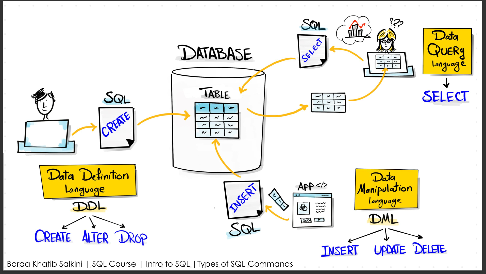

# Basics of Structured Query Language (SQL)

### 📘 Overview

1. **🗄️ What is a Database?**
 - A database is a structured place to store data so it can be retrieved quickly when needed.

2. **💬 What is SQL?**
- SQL (Structured Query Language) is a language used to communicate with relational databases.

3. **🛠️ What is a DBMS?**
- A DBMS (Database Management System) is software that helps you create, manage, and interact with databases.
And it sits between the actual database and the user/client and makes the decision how query to be executed and which query to be executed 
authentication etc..
Examples: PostgreSQL, MySQL, MongoDB

  

4.**🗃️ Types of Databases**
a) **Relational** (uses SQL and stores data in tables)
- a) "Relational" databases organize data into rows and columns with defined relationships.
  - Examples: PostgreSQL, MySQL, Oracle, SQL Server
- b) **NoSQL** (stores data as key-value pairs,graphs(for relations/joins),documents(for files),column based(for better search))
  - Examples: MongoDB(doc), Redis(key-value), Cassandra(columnar), Neo4j(Graph)

  

5. **🧰 Different types of SQL commands**
- We mainly have three categories based on the goal of the command:
  - **🧱 DDL (Data Definition Language):** Create, alter, or remove database structures
    - Examples: `CREATE`, `ALTER`, `DROP`, `TRUNCATE`
  - **📝 DML (Data Manipulation Language):** Insert, update, or delete data in tables
    - Examples: `INSERT`, `UPDATE`, `DELETE`
  - **🔍 DQL (Data Query Language):** Query and read data
    - Examples: `SELECT`, `MIN`, `MAX`, `COUNT`

  

