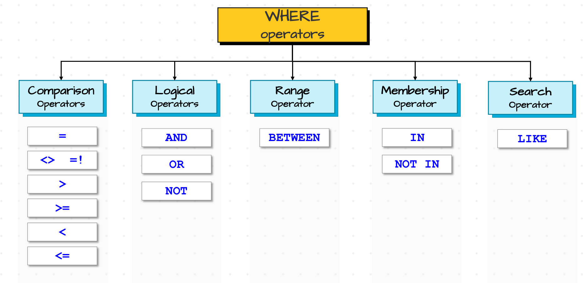

# 🧪 Filtering Data in SQL

🖇️Queries: [Filtering data](./filtering_data.sql)

<div style="text-align:center;">
  
</div>

---

## 🧰 Different Filtering operators 
- Comparison operators
- Logical operators
- Range filtering with BETWEEN
- Membership checks with IN / NOT IN
- Pattern matching with LIKE (%, _)

---

## ⚖️ 1) Comparison Operators

Use comparison operators to filter rows by comparing values.

| Operator | What it does |
|---|---|
| `=` | Equals – matches exact value |
| `!=` / `<>` | Not equal – excludes value |
| `>` | Greater than |
| `<` | Less than |
| `>=` | Greater than or equal |
| `<=` | Less than or equal |

Compare a column to a value and keep rows that satisfy the condition.

SQL:
```sql
-- Example: find customers whose score is not equal to 900
SELECT *
FROM customers
WHERE score <> 900; -- or score != 900
```

---

## 🔗 2) Logical Operators

Combine multiple conditions to refine filters.

| Operator | What it does |
|---|---|
| `AND` | All conditions must be true |
| `OR` | At least one condition must be true |
| `NOT` | Negates a condition |

Chain conditions to narrow (AND) or broaden (OR) results; NOT flips truth. ✅

SQL:
```sql
-- Example: exclude customers with score 900 and country Germany
SELECT *
FROM customers
WHERE score <> 900 AND country <> 'Germany';
```

---

## 📏 3) Range Operator: BETWEEN

Check whether a value falls within a range (inclusive).

| Operator | What it does |
|---|---|
| `BETWEEN a AND b` | Matches values from a to b, inclusive |

BETWEEN includes both endpoints (>= a AND <= b). 📏

SQL:
```sql
-- Example: customers with scores between 0 and 500 (inclusive)
SELECT *
FROM customers
WHERE score BETWEEN 0 AND 500;
```

---

## 🧾 4) Membership Comparison: IN / NOT IN

Test if a value is in a list of values.

| Operator | What it does |
|---|---|
| `IN (v1, v2, ...)` | Matches any value in the list |
| `NOT IN (v1, v2, ...)` | Excludes values in the list |

IN is a compact OR across a set; NOT IN excludes those values. 🧾

SQL:
```sql
-- Example: exclude customers with scores 900 or 350
SELECT *
FROM customers
WHERE score NOT IN (900, 350);
```

---

## 🔤 5) Matching Operator: LIKE with wildcards

Match text patterns using `%` (any length) and `_` (single character).

| Operator | What it does |
|---|---|
| `LIKE` | Pattern match using wildcards |
| `%` | Wildcard: any number of characters (including zero) |
| `_` | Wildcard: exactly one character |

Use LIKE with `%` and `_` to find flexible text patterns. 🔤

SQL:
```sql
-- Example: first_name where 3rd character is 'r' and any chars after
'__r%' ==> means two single chars, then 'r', then any chars
SELECT *
FROM customers
WHERE first_name LIKE '__r%';
```

---

## 💡 Quick Tips
- BETWEEN is inclusive; equivalent to `col >= a AND col <= b`.
- Prefer IN over long OR chains for clarity and performance on small lists.
- NOTE: Watch out for NULLs: `col NOT IN (...)` returns false if `col` is NULL as If the column is NULL, `col NOT IN (...)` evaluates to UNKNOWN which is false → row excluded.
- Some databases support `ILIKE` for case-insensitive matches (e.g., PostgreSQL).
```sql
/*NOTE: ILIKE postgres supports case ignorant like command*/
SELECT * FROM customers WHERE first_name LIKE 'mar%'; --no result
SELECT * FROM customers WHERE first_name ILIKE 'mar%'; --2 rows Maria and Martin
```
