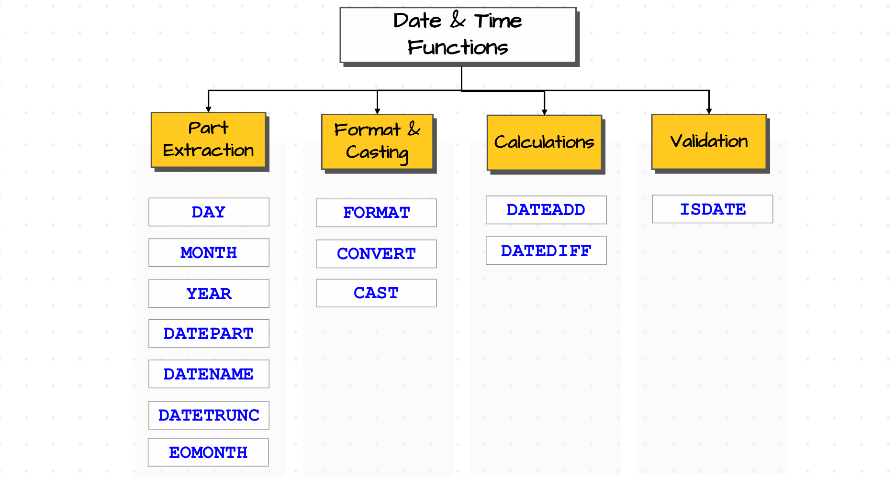

# 🧠 SQL Functions

##### **🖇️Source:** [Functions of SQL](functions.sql)

"A reusable block of logic that takes input, performs some operation, and returns a value"

In the real world, data is **not always clean or ready to use**. Functions help us:
- Transform and clean values 🧹
- Avoid manual repetitive work 🔁
- Reuse logic in many queries 📦

---

## 🧱 Types of Functions

There are mainly **2 types** of functions:

1. **Single Row Functions**  
2. **Multi Row (Aggregate) Functions**

<div style="text-align:center;">
  
</div>

---

## 1️⃣ Single Row Functions

Single row functions work on **one row at a time** and return **one value per row**.

> 📌 Examples: `now()`, `date()`, `abs()`, `upper()`, `length()`, `round()`

They can be grouped into 4 categories:

- a. **String functions** 🔤  
- b. **Numeric functions** 🔢  
- c. **Date & Time functions** 📅  
- d. **Null-related functions** 🚫 (e.g. `COALESCE`)  

Below are detailed examples for each.

---

### a. 🔤 String Functions

<div style="text-align:center;">
  
</div>

#### i. `CONCAT` – Combine multiple strings

> ✨ Goal: Join first name and last name into a single full name.

```sql
-- Get the full names of the sales customers
SELECT CONCAT(sc.firstname, ' ', sc.lastname) AS full_name
FROM sales_customers sc;
```

You can also use the **double pipe** (`||`) operator:

```sql
-- Using || (concatenation operator)
-- ⚠ If any value is NULL, the whole result becomes NULL and no auto type casting is done
SELECT sc.firstname || ' ' || sc.lastname AS full_name
FROM sales_customers sc;
```

---

#### ii. `UPPER` – Convert to uppercase

```sql
-- Print the first_name of all customers in capital letters
SELECT UPPER(firstname) AS first_name_upper
FROM sales_customers sc;
```

---

#### iii. `LOWER` – Convert to lowercase

```sql
-- Print the first_name of all customers in small letters
SELECT LOWER(firstname) AS first_name_lower
FROM sales_customers sc;
```

---

#### iv. `TRIM` – Remove leading and trailing spaces

```sql
-- Identify customers who have leading or trailing spaces in firstname
SELECT first_name
FROM customers c
WHERE c.first_name <> TRIM(c.first_name);  -- e.g. ' john' vs 'john'
```

---

#### v. `REPLACE` – Replace part of a string

```sql
-- Replace '-' by '/' in the phone number
SELECT '123-456-789' AS phone_number,
       REPLACE('123-456-789', '-', '/') AS replaced_phone_number;  -- 123/456/789

-- Replace a multi-character substring
SELECT '123-456-789' AS phone_number,
       REPLACE('123-456-789', '789', '00') AS replaced_phone_number;  -- 123-456-00

-- Remove '-' by replacing with empty string
SELECT '123-456-789' AS phone_number,
       REPLACE('123-456-789', '-', '') AS replaced_phone_number;  -- 123456789
```

---

#### vi. `LENGTH` – Get the length of a value

```sql
-- LENGTH can be applied to text and bytea; others may need casting
SELECT LENGTH('abcde'::bytea) AS bytea_length;
SELECT LENGTH('abcde')        AS text_length;
SELECT LENGTH(TEXT('20251231'::date)) AS date_as_text_length;  -- casting needed
```

---

#### vii. `LEFT` – Get characters from the left

```sql
-- Get the first 3 characters from the firstname of the sales customers
SELECT firstname,
       LEFT(firstname, 3) AS first_three_chars
FROM sales_customers sc;
```

---

#### viii. `RIGHT` – Get characters from the right

```sql
-- Get the last 3 characters from the firstname of the sales customers
SELECT firstname,
       RIGHT(firstname, 3) AS last_three_chars
FROM sales_customers sc;
```

---

#### ix. `SUBSTRING` – Extract a substring

```sql
-- Get the substring from position 2 for the next 3 characters from sales customers' first_name
SELECT sc.firstname,
       SUBSTRING(sc.firstname, 2, 3) AS sub_2_3
FROM sales_customers sc;

-- Get the substring from position 2 to the end of the firstname
SELECT sc.firstname,
       SUBSTRING(sc.firstname, 2, LENGTH(firstname)) AS sub_2_to_end
FROM sales_customers sc;
-- Even if you give a length greater than the string length, it's usually fine
```

---

### b. 🔢 Numeric Functions

#### i. `ROUND` – Round numbers to specific decimal places

```sql
SELECT 3.516 AS number,
       ROUND(3.516, 2) AS number_round_2_decimal,  -- 3.52
       ROUND(3.516, 1) AS number_round_1_decimal,  -- 3.5
       ROUND(3.516)     AS number_round_0_decimal; -- 4
```

---

#### ii. `ABS` – Absolute value

```sql
SELECT -10 AS negative_num,
        ABS(-10) AS absolute_number;  -- 10
```

---

### c. 📅 Date and Time Functions
<div style="text-align:center;">
  
</div>

> **!!! Note:** some of the  functions not present in postgres

#### i. `EXTRACT` – Extract parts of a date/time

```sql
-- Extract date and time components
SELECT so.creation_time,
       EXTRACT(DAY    FROM so.creation_time) AS day,
       EXTRACT(MONTH  FROM so.creation_time) AS month,
       EXTRACT(YEAR   FROM so.creation_time) AS year,
       EXTRACT(HOUR   FROM so.creation_time) AS hour,
       EXTRACT(MINUTE FROM so.creation_time) AS minute,
       EXTRACT(SECOND FROM so.creation_time) AS second
FROM sales_orders so;
```

---

#### ii. `date_part` – Extract components (with more options)

```sql
-- date_part(component, datetime) – similar to EXTRACT, but supports things like week, quarter, etc.
SELECT so.creation_time,
       DATE_PART('day',     so.creation_time) AS day,
       DATE_PART('hour',    so.creation_time) AS hour,
       DATE_PART('week',    so.creation_time) AS week,
       DATE_PART('quarter', so.creation_time) AS quarter
FROM sales_orders so;
```

---

#### iii. `to_char` – Format date/time as string

```sql
-- to_char(datetime, format) returns a STRING representation
SELECT so.creation_time,
       TO_CHAR(so.creation_time, 'day')   AS day_name,
       TO_CHAR(so.creation_time, 'month') AS month_name,
       TO_CHAR(so.creation_time, 'yyyy')  AS year,
       TO_CHAR(so.creation_time, 'hh')    AS hour,
       TO_CHAR(so.creation_time, 'q')     AS quarter
FROM sales_orders so;
```

---

#### iv. `date_trunc` – Truncate date/time to a precision

```sql
-- date_trunc(level, datetime) resets lower parts
-- If level = 'minute' → seconds reset to 00
-- If level = 'day'    → time set to 00:00:00
-- If level = 'month'  → day set to 01 and time to 00:00:00

SELECT so.creation_time,
       DATE_TRUNC('day',   so.creation_time) AS day_date_trunc,
       DATE_TRUNC('hour',  so.creation_time) AS hour_date_trunc,
       DATE_TRUNC('month', so.creation_time) AS month_date_trunc
FROM sales_orders so;
```

```sql
-- Get the first day of the month for each creation_time
SELECT so.creation_time,
       DATE_TRUNC('month', so.creation_time) AS start_of_the_month
FROM sales_orders so;
```

> 💡 **Tip:** Helpful when your data is at **timestamp** level but you want to
> **group by day or month**.

```sql
-- Get the total number of orders for each month
SELECT COUNT(*) AS total_orders,
DATE_TRUNC('month', so.creation_time) AS month
FROM sales_orders so
GROUP BY DATE_TRUNC('month', so.creation_time);
```

###### 📝 Practice Questions

```sql
-- Q1. Number of orders placed for each year
SELECT COUNT(*) AS total_orders,
       EXTRACT(YEAR FROM so.order_date) AS year
FROM sales_orders so
GROUP BY EXTRACT(YEAR FROM so.order_date);
```

```sql
-- Q2. Number of orders placed for each month
SELECT COUNT(*) AS total_orders,
       TO_CHAR(so.order_date, 'month') AS month
FROM sales_orders so
GROUP BY TO_CHAR(so.order_date, 'month');
```

```sql
-- Q3. Show all the orders that were placed in February
SELECT *
FROM sales_orders so
WHERE EXTRACT(MONTH FROM so.order_date) = 2;
```
