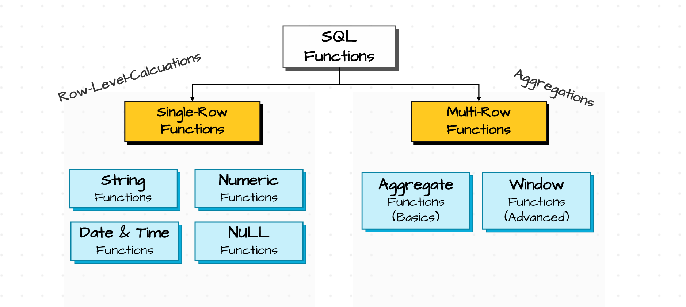
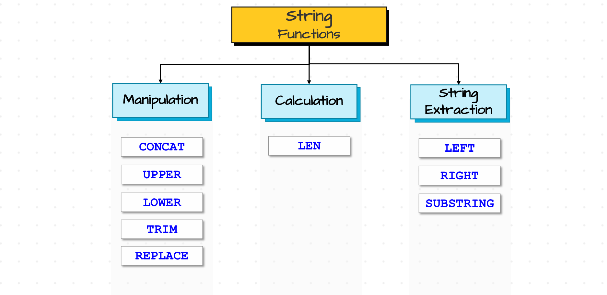

# 🧠 SQL Functions

##### **🖇️Source:** [Functions of SQL](functions.sql)

"A reusable block of logic that takes input, performs some operation, and returns a value"

In the real world, data is **not always clean or ready to use**. Functions help us:
- Transform and clean values 🧹
- Avoid manual repetitive work 🔁
- Reuse logic in many queries 📦

---

## 🧱 Types of Functions

There are mainly **2 types** of functions:

1. **Single Row Functions**  
2. **Multi Row (Aggregate) Functions**

<div style="text-align:center;">
  
</div>

---

## 1️⃣ Single Row Functions

Single row functions work on **one row at a time** and return **one value per row**.

> 📌 Examples: `now()`, `date()`, `abs()`, `upper()`, `length()`, `round()`

They can be grouped into 4 categories:

- a. **String functions** 🔤  
- b. **Numeric functions** 🔢  
- c. **Date & Time functions** 📅  
- d. **Null-related functions** 🚫 (e.g. `COALESCE`)  

Below are detailed examples for each.

---

### a. 🔤 String Functions

<div style="text-align:center;">
  
</div>

#### i. `CONCAT` – Combine multiple strings

> ✨ Goal: Join first name and last name into a single full name.

```sql
-- Get the full names of the sales customers
SELECT CONCAT(sc.firstname, ' ', sc.lastname) AS full_name
FROM sales_customers sc;
```

You can also use the **double pipe** (`||`) operator:

```sql
-- Using || (concatenation operator)
-- ⚠ If any value is NULL, the whole result becomes NULL and no auto type casting is done
SELECT sc.firstname || ' ' || sc.lastname AS full_name
FROM sales_customers sc;
```

---

#### ii. `UPPER` – Convert to uppercase

```sql
-- Print the first_name of all customers in capital letters
SELECT UPPER(firstname) AS first_name_upper
FROM sales_customers sc;
```

---

#### iii. `LOWER` – Convert to lowercase

```sql
-- Print the first_name of all customers in small letters
SELECT LOWER(firstname) AS first_name_lower
FROM sales_customers sc;
```

---

#### iv. `TRIM` – Remove leading and trailing spaces

```sql
-- Identify customers who have leading or trailing spaces in firstname
SELECT first_name
FROM customers c
WHERE c.first_name <> TRIM(c.first_name);  -- e.g. ' john' vs 'john'
```

---

#### v. `REPLACE` – Replace part of a string

```sql
-- Replace '-' by '/' in the phone number
SELECT '123-456-789' AS phone_number,
       REPLACE('123-456-789', '-', '/') AS replaced_phone_number;  -- 123/456/789

-- Replace a multi-character substring
SELECT '123-456-789' AS phone_number,
       REPLACE('123-456-789', '789', '00') AS replaced_phone_number;  -- 123-456-00

-- Remove '-' by replacing with empty string
SELECT '123-456-789' AS phone_number,
       REPLACE('123-456-789', '-', '') AS replaced_phone_number;  -- 123456789
```

---

#### vi. `LENGTH` – Get the length of a value

```sql
-- LENGTH can be applied to text and bytea; others may need casting
SELECT LENGTH('abcde'::bytea) AS bytea_length;
SELECT LENGTH('abcde')        AS text_length;
SELECT LENGTH(TEXT('20251231'::date)) AS date_as_text_length;  -- casting needed
```

---

#### vii. `LEFT` – Get characters from the left

```sql
-- Get the first 3 characters from the firstname of the sales customers
SELECT firstname,
       LEFT(firstname, 3) AS first_three_chars
FROM sales_customers sc;
```

---

#### viii. `RIGHT` – Get characters from the right

```sql
-- Get the last 3 characters from the firstname of the sales customers
SELECT firstname,
       RIGHT(firstname, 3) AS last_three_chars
FROM sales_customers sc;
```

---

#### ix. `SUBSTRING` – Extract a substring

```sql
-- Get the substring from position 2 for the next 3 characters from sales customers' first_name
SELECT sc.firstname,
       SUBSTRING(sc.firstname, 2, 3) AS sub_2_3
FROM sales_customers sc;

-- Get the substring from position 2 to the end of the firstname
SELECT sc.firstname,
       SUBSTRING(sc.firstname, 2, LENGTH(firstname)) AS sub_2_to_end
FROM sales_customers sc;
-- Even if you give a length greater than the string length, it's usually fine
```

---

### b. 🔢 Numeric Functions

#### i. `ROUND` – Round numbers to specific decimal places

```sql
SELECT 3.516 AS number,
       ROUND(3.516, 2) AS number_round_2_decimal,  -- 3.52
       ROUND(3.516, 1) AS number_round_1_decimal,  -- 3.5
       ROUND(3.516)     AS number_round_0_decimal; -- 4
```

---

#### ii. `ABS` – Absolute value

```sql
SELECT -10 AS negative_num,
        ABS(-10) AS absolute_number;  -- 10
```

---

### c. 📅 Date and Time Functions

#### i. `EXTRACT` – Extract parts of a date/time

```sql
-- Extract date and time components
SELECT so.creation_time,
       EXTRACT(DAY    FROM so.creation_time) AS day,
       EXTRACT(MONTH  FROM so.creation_time) AS month,
       EXTRACT(YEAR   FROM so.creation_time) AS year,
       EXTRACT(HOUR   FROM so.creation_time) AS hour,
       EXTRACT(MINUTE FROM so.creation_time) AS minute,
       EXTRACT(SECOND FROM so.creation_time) AS second
FROM sales_orders so;
```

---

#### ii. `date_part` – Extract components (with more options)

```sql
-- date_part(component, datetime) – similar to EXTRACT, but supports things like week, quarter, etc.
SELECT so.creation_time,
       DATE_PART('day',     so.creation_time) AS day,
       DATE_PART('hour',    so.creation_time) AS hour,
       DATE_PART('week',    so.creation_time) AS week,
       DATE_PART('quarter', so.creation_time) AS quarter
FROM sales_orders so;
```

---

#### iii. `to_char` – Format date/time as string

```sql
-- to_char(datetime, format) returns a STRING representation
SELECT so.creation_time,
       TO_CHAR(so.creation_time, 'day')   AS day_name,
       TO_CHAR(so.creation_time, 'month') AS month_name,
       TO_CHAR(so.creation_time, 'yyyy')  AS year,
       TO_CHAR(so.creation_time, 'hh')    AS hour,
       TO_CHAR(so.creation_time, 'q')     AS quarter
FROM sales_orders so;
```

---

#### iv. `date_trunc` – Truncate date/time to a precision

```sql
-- date_trunc(level, datetime) resets lower parts
-- If level = 'minute' → seconds reset to 00
-- If level = 'day'    → time set to 00:00:00
-- If level = 'month'  → day set to 01 and time to 00:00:00

SELECT so.creation_time,
       DATE_TRUNC('day',   so.creation_time) AS day_date_trunc,
       DATE_TRUNC('hour',  so.creation_time) AS hour_date_trunc,
       DATE_TRUNC('month', so.creation_time) AS month_date_trunc
FROM sales_orders so;
```

```sql
-- Get the first day of the month for each creation_time
SELECT so.creation_time,
       DATE_TRUNC('month', so.creation_time) AS start_of_the_month
FROM sales_orders so;
```

> 💡 **Tip:** Helpful when your data is at **timestamp** level but you want to
> **group by day or month**.

```sql
-- Get the total number of orders for each month
SELECT COUNT(*) AS total_orders,
DATE_TRUNC('month', so.creation_time) AS month
FROM sales_orders so
GROUP BY DATE_TRUNC('month', so.creation_time);
```

###### 📝 Practice Questions

```sql
-- Q1. Number of orders placed for each year
SELECT COUNT(*) AS total_orders,
       EXTRACT(YEAR FROM so.order_date) AS year
FROM sales_orders so
GROUP BY EXTRACT(YEAR FROM so.order_date);
```

```sql
-- Q2. Number of orders placed for each month
SELECT COUNT(*) AS total_orders,
       TO_CHAR(so.order_date, 'month') AS month
FROM sales_orders so
GROUP BY TO_CHAR(so.order_date, 'month');
```

```sql
-- Q3. Show all the orders that were placed in February
SELECT *
FROM sales_orders so
WHERE EXTRACT(MONTH FROM so.order_date) = 2;
```

---

#### v. 🔄 `CAST` – Convert one data type to another

> Use `CAST(expr AS type)` or the shorthand `expr::type` to convert values between compatible data types.

```sql
-- Using CAST()
SELECT CAST(123 AS text)        AS "number as text",
       CAST(123 AS int)         AS "number as int",
       CAST('20241231' AS text) AS "date as text",
       CAST('20241231' AS date) AS "date as date",
       so.creation_time,
       CAST(so.creation_time AS date) AS "creation time as date"
FROM sales_orders so;
```

```sql
-- Using :: (PostgreSQL-style cast)
SELECT 123::text        AS "number as text",
       123::int         AS "number as int",
       '20241231'::text AS "date as text",
       '20241231'::date AS "date as date",
       so.creation_time,
       so.creation_time::date AS "creation time as date"
FROM sales_orders so;
```

---

#### vi. ⏱️ `INTERVAL` – Work with time durations

> `INTERVAL` represents a **duration of time** (like `1 day`, `2 hours`, `3 months`).
> You can **add** or **subtract** intervals to/from date or timestamp columns.

```sql
SELECT so.order_date,
so.order_date - INTERVAL '10 days'  AS before_10_days_of_order_date,
so.order_date - INTERVAL '4 hours'  AS before_4_hours_of_order_date,
so.order_date + INTERVAL '2 years'  AS after_2_years_of_order_date,
so.order_date + INTERVAL '2 days 2 months 2 years' AS after_2_D_2_M_2_Y_of_order_date -- multi-part interval
FROM sales_orders so;
```

---

#### vii. 📏 `AGE` – Calculate the difference between two dates/timestamps

> `AGE(later, earlier)` returns the **time difference** between two date/timestamp values.

```sql
-- Difference between a future date and order_date
SELECT so.order_date,
AGE('2025-12-31'::date, so.order_date) AS order_date_from_2024_EOY
FROM sales_orders so;
```

```sql
-- 🕒 Q: Find the shipping duration of the orders
SELECT so.order_id, so.order_date, so.ship_date,
AGE(so.ship_date, so.order_date) AS duration_of_the_order
FROM sales_orders so;
```

```sql
-- 📊 Q: Get the average order duration for each month
SELECT DATE_PART('month', so.order_date) AS month,
AVG(AGE(so.ship_date, so.order_date)) AS avg_order_duration
FROM sales_orders so
GROUP BY DATE_PART('month', so.order_date);
```

---

### d. 🚫 Null-related Functions

Null-related functions help you **safely handle missing values** and avoid wrong calculations or errors.

#### i. 🧩 `COALESCE` – First non-NULL value

> Takes **multiple values** and returns the **first non-NULL** among them.
> Any math operation with `NULL` (like `-`, `+`, `||`, etc.) results in `NULL`, even if the other value is non-null.

> 🎯 **Goal:** get the fullname of all the customers and give a bonus of 100 score for each


```sql
-- ❌ Without COALESCE →  we will have the null if any name or the score is null
SELECT sc.firstname,
       sc.lastname,
       (firstname || ' ' || lastname) AS fullname,
       score,
       score + 100 AS bonus_score
FROM sales_customers sc;
```

```sql
-- ✅ With COALESCE → handle NULLs gracefully
SELECT sc.firstname,
       sc.lastname,
       (COALESCE(firstname, '') || ' ' || COALESCE(lastname, '')) AS fullname,
       score,
       COALESCE(score, 0) + 100 AS bonus_score
FROM sales_customers sc;
```

> 🎯 **Goal:** get the address for each order considering the preority for the address as ship address >> bill address >> 'NOT PROVIDED'.

```sql
SELECT order_id,
       so.ship_address,
       so.bill_address,
       COALESCE(so.ship_address, so.bill_address, 'NOT PROVIDED') AS address
FROM sales_orders so;
```

> ⚠ **Important:** Aggregate functions like `AVG(col)` **ignore NULLs**.
> - This can give **wrong-looking results** if you expected NULLs to be treated as 0.
> - `COUNT(*)` is an exception – it counts **rows**, not non-null values.

```sql
> Q: Get the average score of the customers
-- Suppose total score (including NULL row as 0) should be 2500 with 5 customers

-- ❌ Without COALESCE (2500 / 4 = 625)
-- One row has score = NULL → ignored by AVG
SELECT AVG(sc.score) AS avg_score
FROM sales_customers sc;  -- e.g. 625 (skips NULL row)
```

```sql
-- ✅ With COALESCE (2500 / 5 = 500)
-- Replace NULL with 0 so all rows are included in the average
SELECT AVG(COALESCE(score, 0)) AS avg_score_including_nulls_as_zero
FROM sales_customers sc;  -- e.g. 500
```

---

#### ii. ⚖️ `NULLIF` – Return NULL when two values are equal

> `NULLIF(value, compare_value)`
> - If `value = compare_value` → returns **NULL**
> - Else → returns **value**
>
> 🔐 Super useful to **avoid division by zero** errors.

```sql
-- If both values are same → NULL
SELECT NULLIF(100, 100) AS result;  -- NULL

-- If values are different → first value
SELECT NULLIF(100, 20) AS result;   -- 100
```

> 🎯 **Goal:** Calculate sale price per quantity safely.

```sql
SELECT order_id,
       so.sales,
       so.quantity,
       (so.sales / NULLIF(so.quantity, 0)) AS sale_price_per_quantity
FROM sales_orders so;
-- If quantity = 0 → NULLIF(quantity, 0) becomes NULL
-- so.sales / NULL → result is NULL instead of division-by-zero error
```

---

#### iii. 🔍 `IS NULL` and `IS NOT NULL` – Filter by NULL values

> These are used to **filter rows** based on whether a column is NULL or not.
> Also very useful for **anti joins**.

```sql
-- Q: Get all customers who have NO score
SELECT *
FROM sales_customers sc
WHERE sc.score IS NULL;
```

```sql
-- Q: Get all customers who HAVE a score
SELECT *
FROM sales_customers sc
WHERE sc.score IS NOT NULL;
```

```sql
-- Q: Select all customers who have NO orders present in orders table (Left Anti Join)
SELECT *
FROM sales_customers sc
LEFT JOIN sales_orders so
  ON sc.customer_id = so.customer_id
WHERE so.customer_id IS NULL;  -- customers with no matching order
```

---

#### iv. 📊 `NULLS FIRST` & `NULLS LAST` – Control sort order of NULLs

> By default:
> - In **`DESC`** order → NULLs often appear **first**
> - In **`ASC`** order → NULLs often appear **last**
>
> Use `NULLS FIRST` / `NULLS LAST` to **override** this behavior explicitly.

```sql
-- Q: Sort customers by score in DESC order, keeping NULLs at the END
SELECT *
FROM sales_customers c
ORDER BY score DESC NULLS LAST;
```

```sql
-- Q: Sort customers by score in ASC order, keeping NULLs at the TOP
SELECT *
FROM sales_customers c
ORDER BY score ASC NULLS FIRST;
```

