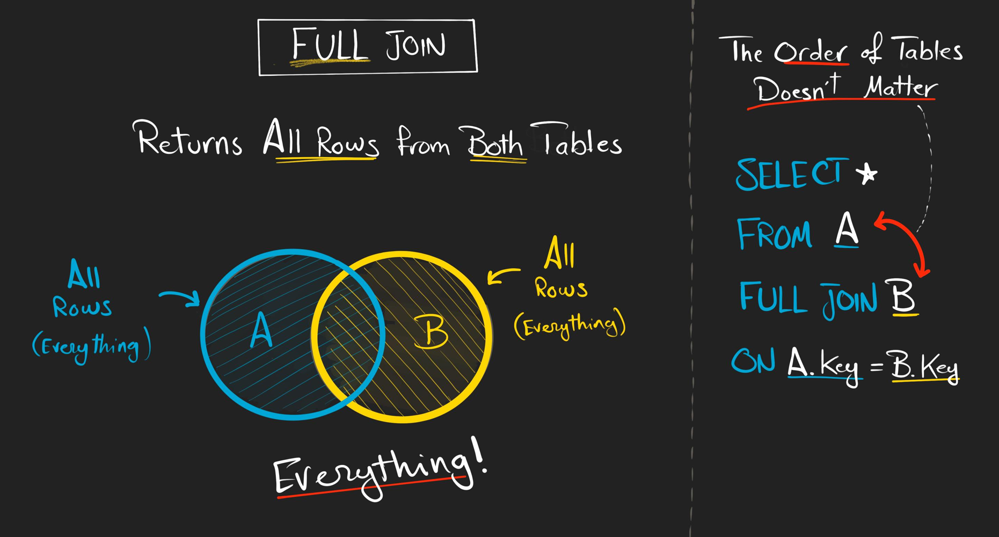
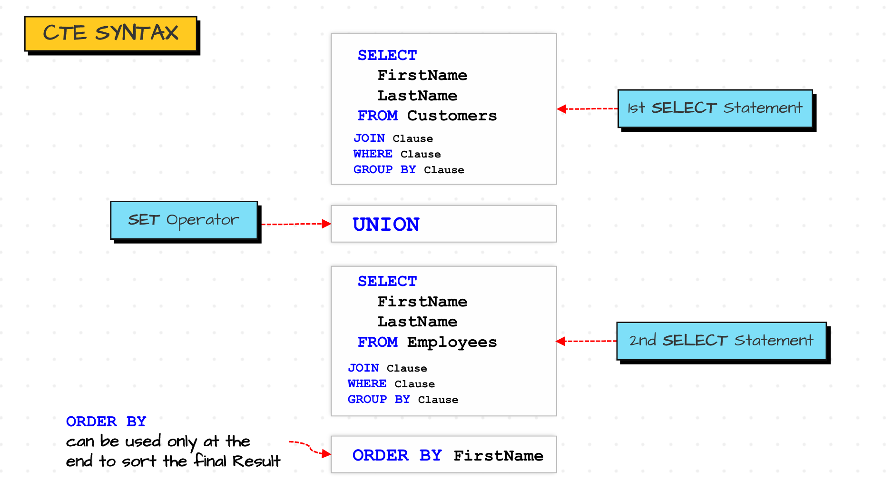
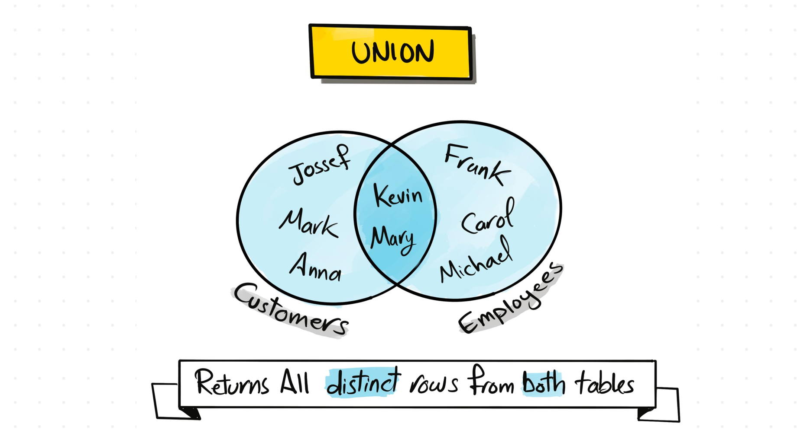
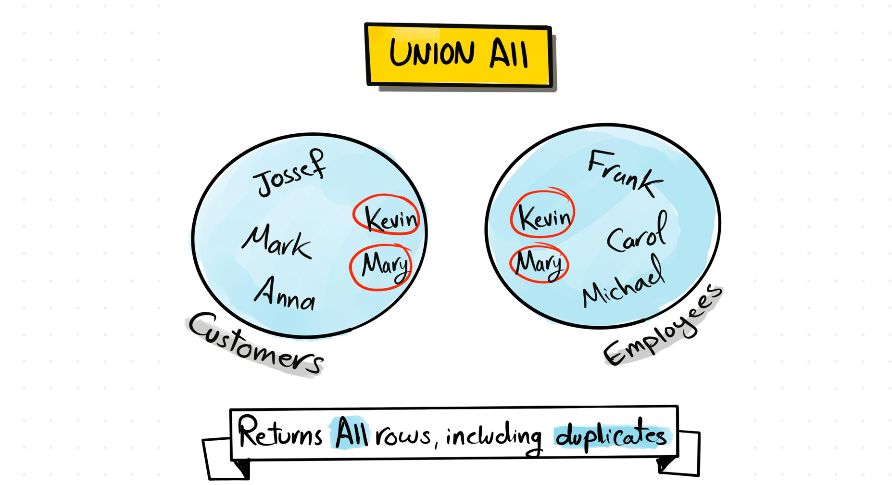
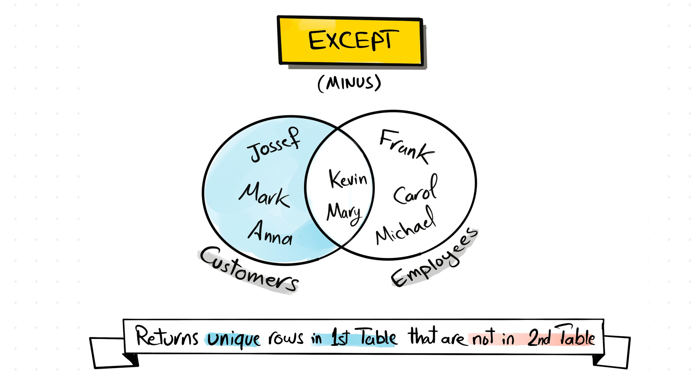
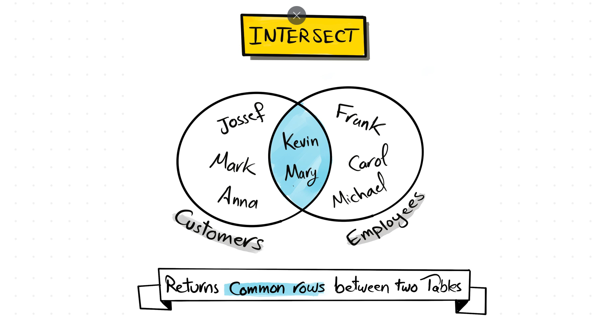
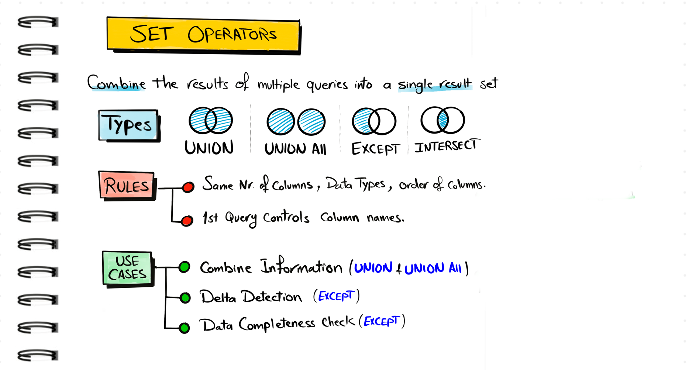

# 🔗 Joins in SQL

🖇️Queries: [Joins](joins.sql)
## ❓ Why Joins?
In the real world, data in one table is often **related** to data in another table.
For example, **orders** are related to a particular **customer**. When we want to
see data **together with its related data**, we use **joins**.

We can combine data in **two main ways**:

1. **Column-wise joins** 👉 Bring different kinds of data from **more than one table** into a single result set.  
   - The **number of columns increases** (wider table).
2. **Row-wise set operations** 👉 Combine the **same kind of data** (same columns) from multiple tables.  
   - The **number of rows increases or decreases**:  
     - `UNION` ➕ increases rows  
     - `INTERSECT` / `EXCEPT` ➖ may reduce rows

<div style="text-align:center;">
  
</div>

---
# 1. Column-wise Joins

## 🧩 Types of Joins (Column-wise)
When we join two tables, we may want to see:
- Only **matching** data in both
- **Everything** from one side and matching from the other side 
- **Non matching** from one side

<div style="text-align:center;">
  
</div>

Based on these possibilities, we typically talk about **9 joins**:
- **5 basic joins**
- **4 advanced (anti / special) joins**

---

## 🅰️ Basic Joins

<div style="text-align:center;">
  
</div>

### 1️⃣ No Join (Just Separate Queries)
Return data from each table **individually**, without combining them.

<div style="text-align:center;">
  
</div>

```sql
SELECT * 
FROM customers;

SELECT * 
FROM orders;

```

---

### 2️⃣ 🤝 INNER JOIN
**Inner Join** brings only the **matching rows** that exist in **both tables**.

<div style="text-align:center;">
  
</div>

Use case: _Select all the customers who have made **at least one** order._

```sql
SELECT c.first_name, o.order_id ,o.sales 
FROM customers c 
JOIN orders o  --by default the join INNER u can mention it explicitely 
ON c.id = o.customer_id;
```

---

### 3️⃣ 👈 LEFT JOIN
**Left Join** returns **all rows from the left table**, and only the **matching rows
from the right table**. If there is **no match**, the right table columns become **NULL**.

<div style="text-align:center;">
  
</div>

Use case: _Get all customers, whether they have orders or not._

```sql
SELECT c.first_name, o.order_id, o.sales 
FROM customers c 
LEFT JOIN orders o 
ON c.id  = o.customer_id;
```

---

### 4️⃣ 👉 RIGHT JOIN
**Right Join** returns **all rows from the right table**, and only the **matching rows
from the left table**. If there is **no match**, the left table columns become **NULL**.

<div style="text-align:center;">
  
</div>

Use case: _Get all orders, even if they don’t have a matching customer (e.g., bad data)._ 

```sql
SELECT c.first_name, o.order_id, o.sales  
FROM customers c 
RIGHT JOIN orders o 
ON c.id  = o.customer_id;
```

---

### 5️⃣ 🌐 FULL OUTER JOIN
**Full Join** returns **all rows from both tables**.  
If a record has **no match** in the other table, its columns from that table become **NULL**.

```sql
-- Get all customers and all orders, even if there is no match
SELECT c.first_name,o.order_id, o.sales 
FROM customers c 
FULL JOIN orders o  
ON c.id = o.customer_id ;

```

<div style="text-align:center;">
  
</div>

---

## 🅱️ Advanced Joins (Anti Joins & Special)

<div style="text-align:center;">
  
</div>

> 🔎 **Note:** For "anti joins" there is usually **no special keyword** in SQL.  
> We simulate them using a **LEFT/RIGHT/FULL JOIN + a WHERE condition**.

### 1️⃣ 🚫 Left Anti Join
**Left Anti Join** returns rows from the **left table** that **do NOT have a match** in the right table.

<div style="text-align:center;">
  
</div>

Use case: _Get all customers who **don’t** have any orders._

```sql
SELECT c.first_name, o.order_id, o.sales  
FROM customers c 
LEFT JOIN orders o 
ON c.id = o.customer_id
WHERE o.customer_id IS NULL; --all the left table data where right table don't have entry
```

---

### 2️⃣ 🚫 Right Anti Join
**Right Anti Join** returns rows from the **right table** that **do NOT have a match** in the left table.

<div style="text-align:center;">
  
</div>

Use case: _Get all orders that **don’t** have a valid customer in the `customers` table._

```sql
SELECT c.first_name, o.order_id, o.sales  
FROM customers c 
RIGHT JOIN orders o 
ON c.id = o.customer_id
WHERE c.id  IS NULL; --all the right table data where left table don't have entry
```

---

### 3️⃣ 🚫 Full Anti Join
**Full Anti Join** returns rows from **both tables** where there is **no matching row in the other table**.

<div style="text-align:center;">
  
</div>

Use case: _Get all customers and orders that **don’t** have a corresponding valid entry in the other table._

```sql
SELECT c.first_name, o.order_id, o.sales  
FROM customers c
FULL JOIN orders o 
ON c.id = o.customer_id 
WHERE o.customer_id  IS NULL OR c.id IS NULL;
```

---

### 4️⃣ ✖️ CROSS / CARTESIAN JOIN
A **Cross Join** pairs **every row** from one table with **every row** in the other table.  
It does **not** require a join condition.

<div style="text-align:center;">
  
</div>

```sql
SELECT c.first_name, o.order_id, o.sales 
FROM customers c
CROSS JOIN orders o ; --this joins don't need any matching key 
```

---

## 🧠 How to Decide Which Join to Use?

Use this **decision tree** to help you pick the right join:

<div style="text-align:center;">
  
</div>

- Do you want **only matching rows**? → Use **INNER JOIN** 🔍
- Do you want **everything from one table**, and matching from the other? → Use **LEFT** or **RIGHT JOIN** ⬅️➡️
- Do you want **everything from both tables**? → Use **FULL JOIN** 🌐
- Do you want **only non-matching rows**? → Use **Anti Joins** (LEFT/RIGHT/FULL + `WHERE ... IS NULL`) 🚫
- Do you want **every combination of rows**? → Use **CROSS JOIN** ✖️


## 🔗 Multi Joins

We can also join **more than two tables** in a single query to get richer information.

> 💡 **Example task:** Using `SalesDB`, retrieve a list of all orders along with the related
> customer, product, and employee details. Show: **Order ID**, **Customer's name**,
> **Product name**, **Sales**, **Price**, and **Sales person's name**.

```sql
-- Multi-join example: sales_orders + sales_customers + sales_products + sales_employee
SELECT 
    so.order_id,
    sc.firstname      AS customer_name,
    sp.product        AS product_name,
    so.sales,
    sp.price,
    se.first_name     AS sales_person
FROM sales_orders so
LEFT JOIN sales_customers sc ON sc.customer_id = so.customer_id
LEFT JOIN sales_products  sp ON sp.product_id   = so.product_id
LEFT JOIN sales_employee  se ON se.employee_id  = so.sales_person_id;
```

---

# 2. Row-wise Joins (SET Operations)

Row-wise joins (also called **set operations**) combine results from **two `SELECT` queries vertically**.  
They may **increase or decrease the number of rows**, but the **columns must be compatible**.

### ✅ Rules for Set Operations

1. The **number of columns** must be the same in both queries.  
2. The **data types** of each column position must be **compatible** (e.g., `INTEGER` with `DECIMAL` is fine; `INTEGER` with `TEXT` is not).  
3. The **order/position** of columns matters — set operators use **column positions**, **not names**.  
4. The **final column names / aliases** come from the **first `SELECT`**.  
5. `ORDER BY` can be used **only once**, and it must be at the **very end** of the full set operation.

> 📐 **General Syntax**
>
> ```sql
> SELECT ...         -- may include WHERE, GROUP BY, JOIN, etc.
> set_operator       -- UNION, UNION ALL, EXCEPT, INTERSECT, EXCEPT ALL, INTERSECT ALL
> SELECT ...         -- may include WHERE, GROUP BY, JOIN, etc.
> ORDER BY ...;      -- only once, at the end
> ```

<div style="text-align:center;">
  
</div>

---

## 🧮 Set Operations Overview

Below are the main **set operators** used with row-wise joins:

| Operator        | What it does (1‑liner) |
|-----------------|------------------------|
| `UNION`         | Combines results from both queries and **removes duplicates**. |
| `UNION ALL`     | Combines results from both queries and **keeps duplicates**. |
| `EXCEPT`        | Returns **distinct rows from the first query** that are **not present in the second**. |
| `INTERSECT`     | Returns **distinct rows common** to **both** queries. |
| `EXCEPT ALL`    | Like `EXCEPT`, but **count-based** and respects duplicates. |
| `INTERSECT ALL` | Like `INTERSECT`, but **count-based** and respects duplicates. |

---

### 1️⃣ `UNION` – Distinct Rows from Both

➡️ **Goal:** Combine data from **employees** and **customers**, removing duplicates.  
If `Kevin` and `Mary` appear in both tables with the **same `id` and `name`**, the final result shows them **only once**.

```sql
-- 1. UNION: all DISTINCT rows from both SELECTs

SELECT sc.firstname AS name, sc.customer_id AS id          -- column names come from the FIRST select
FROM sales_customers sc              -- each SELECT can have joins, WHERE, GROUP BY, etc.
UNION                                -- UNION removes duplicate rows
SELECT se.first_name, se.employee_id
FROM sales_employee se
ORDER BY id;                         -- ORDER BY only once, at the end
```

<div style="text-align:center;">
  
</div>

---

### 2️⃣ `UNION ALL` – Keep All Rows (Including Duplicates)

➡️ **Goal:** Combine data from employees and customers, **keeping duplicates**.  
`Kevin` and `Mary` will appear **twice** if they exist in **both** tables with the same values.

```sql
-- 2. UNION ALL: ALL rows, including duplicates

SELECT sc.firstname AS name, sc.customer_id AS id
FROM sales_customers sc
UNION ALL                           -- keeps duplicates
SELECT se.first_name,se.employee_id
FROM sales_employee se;
```

<div style="text-align:center;">
  
</div>

> **NOTE:** `UNION ALL` is usually faster than `UNION` because it does **not** check for duplicate rows.

---

### 3️⃣ `EXCEPT` – In First, Not in Second

➡️ **Goal:** Get **customers who are NOT employees** at the same time.  
If `Kevin` and `Mary` are both **customers and employees**, they will be **removed** from the result.

```sql
-- 3. EXCEPT: distinct rows from the FIRST query
--           that are NOT present in the SECOND

SELECT sc.firstname AS name, sc.customer_id AS id
FROM sales_customers sc
EXCEPT                               -- keeps only rows from FIRST not in SECOND
SELECT se.first_name, se.employee_id
FROM sales_employee se;
```

<div style="text-align:center;">
  
</div>

> **NOTE:** Order matters here.  
> `FIRST minus SECOND` ≠ `SECOND minus FIRST`.

---

### 4️⃣ `INTERSECT` – Common Rows in Both

➡️ **Goal:** Get **customers who are also employees**.  
If only `Kevin` and `Mary` are both customers and employees, only they will appear.

```sql
-- 4. INTERSECT: distinct rows that are COMMON to both queries

SELECT sc.firstname AS name, sc.customer_id AS id
FROM sales_customers sc
INTERSECT                            -- keeps only common distinct rows
SELECT se.first_name, se.employee_id
FROM sales_employee se;
```

<div style="text-align:center;">
  
</div>

> **NOTE:** Order does **not** matter here — result is the common rows.

---

### 5️⃣ `EXCEPT ALL` – Count-based Difference

`EXCEPT ALL` works like `EXCEPT`, but it uses **counts** of duplicates:
- For each distinct row: `result_count = count_in_first - count_in_second` (but not below 0).

```sql
-- EXAMPLE: EXCEPT ALL is count-based
-- First set has 3 copies of 1, second set has 2 copies of 1

(
  SELECT 1
  UNION ALL
  SELECT 1
  UNION ALL
  SELECT 1
)
EXCEPT ALL
(
  SELECT 1
  UNION ALL
  SELECT 1
);  -- result: a single `1`  (3 - 2 = 1)

-- Without parentheses, evaluation is LEFT to RIGHT
-- so the behavior changes

SELECT 1
UNION ALL
SELECT 1
UNION ALL
SELECT 1
EXCEPT ALL
SELECT 1
UNION ALL
SELECT 1;  -- result: three `1`s (3 - 1 + 1 = 3)
```
---

### 6️⃣ `INTERSECT ALL` – Count-based Common Rows

`INTERSECT ALL` keeps rows that are common to both queries, but **respects duplicate counts**:  
For each distinct row: `result_count = MIN(count_in_first, count_in_second)`.

```sql
-- EXAMPLE: INTERSECT ALL is count-based

(SELECT 1
 UNION ALL
 SELECT 1
 UNION ALL
 SELECT 1)

INTERSECT ALL

(SELECT 1
 UNION ALL
 SELECT 1);  -- result: two `1`s → MIN(3, 2) = 2


SELECT 1
UNION ALL
SELECT 1
UNION ALL
SELECT 1
INTERSECT ALL
SELECT 1
UNION ALL
SELECT 1;  -- result: four `1`s
           -- INTERSECT ALL has higher precedence:
           --   (1 INTERSECT ALL 1 = 1) + remaining 3 via UNION ALL = 4
```
## Summary of set operations:

<div style="text-align:center;">
  
</div>

