# 🔗 Joins in SQL

🖇️Queries: [Joins](joins.sql)
## ❓ Why Joins?
In the real world, data in one table is often **related** to data in another table.
For example, **orders** are related to a particular **customer**. When we want to
see data **together with its related data**, we use **joins**.

We can combine data in **two main ways**:

1. **Column-wise joins** 👉 Bring different kinds of data from **more than one table** into a single result set.  
   - The **number of columns increases** (wider table).
2. **Row-wise set operations** 👉 Combine the **same kind of data** (same columns) from multiple tables.  
   - The **number of rows increases or decreases**:  
     - `UNION` ➕ increases rows  
     - `INTERSECT` / `EXCEPT` ➖ may reduce rows

<div style="text-align:center;">
  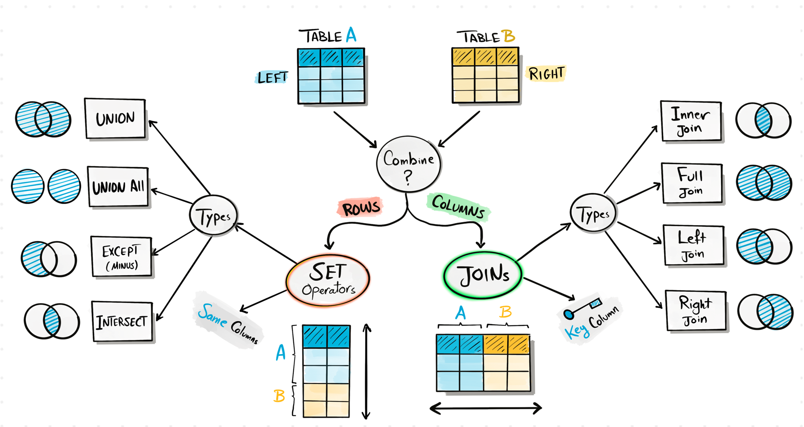
</div>

---

## 🧩 Types of Joins (Column-wise)
When we join two tables, we may want to see:
- Only **matching** data in both
- **Everything** from one side and matching from the other side 
- **Non matching** from one side

<div style="text-align:center;">
  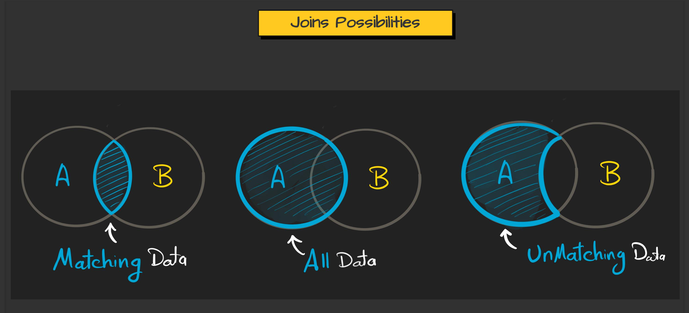
</div>

Based on these possibilities, we typically talk about **9 joins**:
- **5 basic joins**
- **4 advanced (anti / special) joins**

---

## 🅰️ Basic Joins

<div style="text-align:center;">
  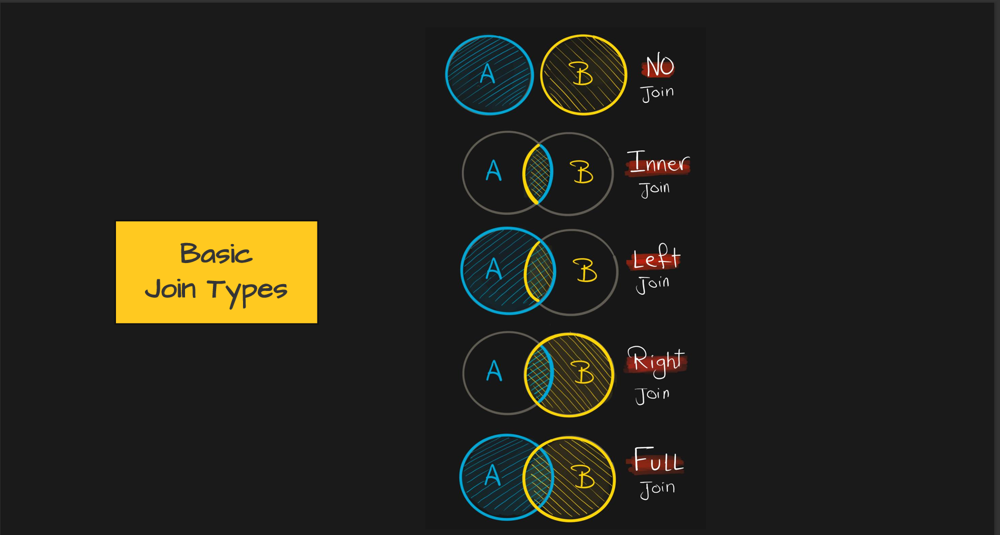
</div>

### 1️⃣ No Join (Just Separate Queries)
Return data from each table **individually**, without combining them.

<div style="text-align:center;">
  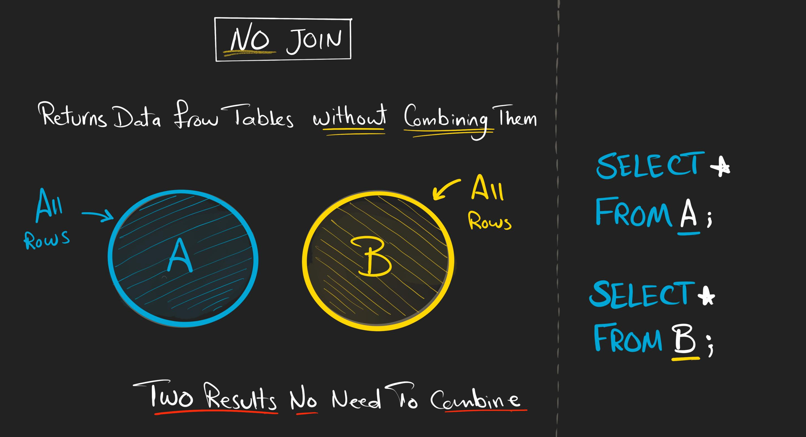
</div>

```sql
SELECT * 
FROM customers;

SELECT * 
FROM orders;

```

---

### 2️⃣ 🤝 INNER JOIN
**Inner Join** brings only the **matching rows** that exist in **both tables**.

<div style="text-align:center;">
  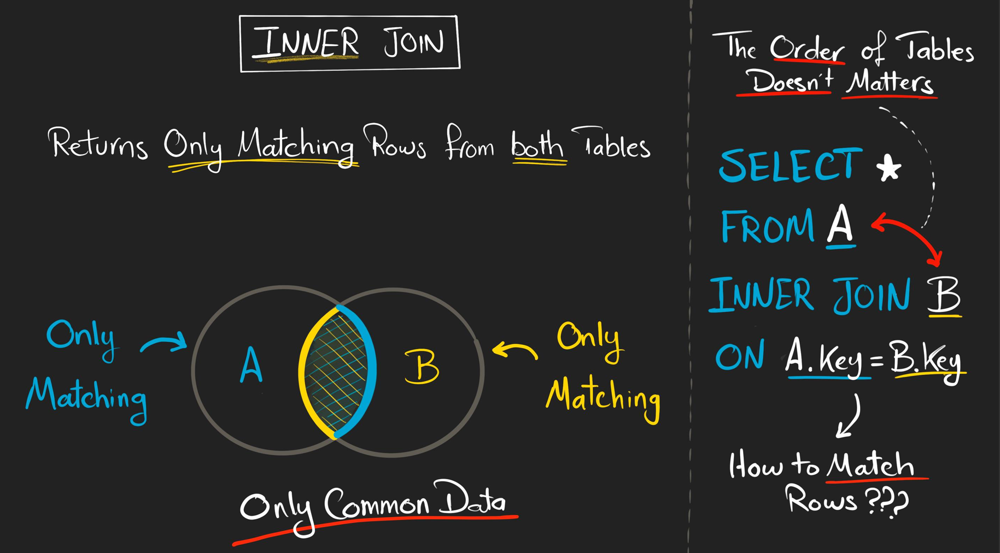
</div>

Use case: _Select all the customers who have made **at least one** order._

```sql
SELECT c.first_name, o.order_id ,o.sales 
FROM customers c 
JOIN orders o 
ON c.id = o.customer_id; --by default the join INNER u can mention it explicitely 
```

---

### 3️⃣ 👈 LEFT JOIN
**Left Join** returns **all rows from the left table**, and only the **matching rows
from the right table**. If there is **no match**, the right table columns become **NULL**.

<div style="text-align:center;">
  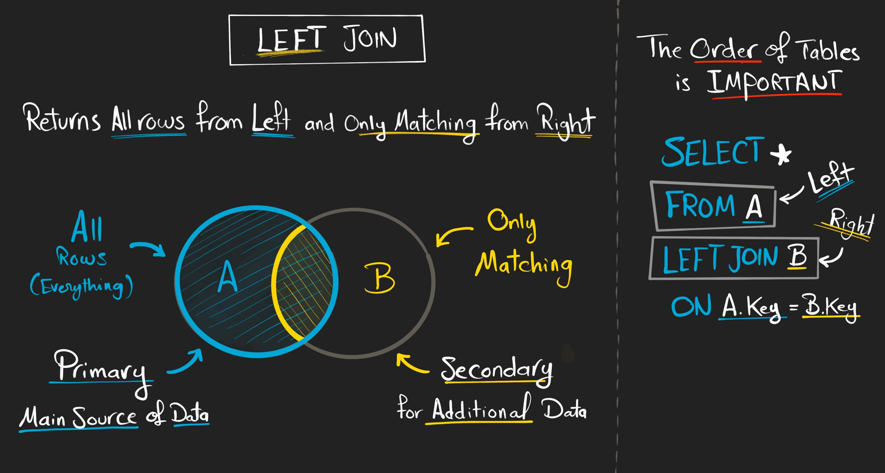
</div>

Use case: _Get all customers, whether they have orders or not._

```sql
SELECT c.first_name, o.order_id, o.sales 
FROM customers c 
LEFT JOIN orders o 
ON c.id  = o.customer_id;
```

---

### 4️⃣ 👉 RIGHT JOIN
**Right Join** returns **all rows from the right table**, and only the **matching rows
from the left table**. If there is **no match**, the left table columns become **NULL**.

<div style="text-align:center;">
  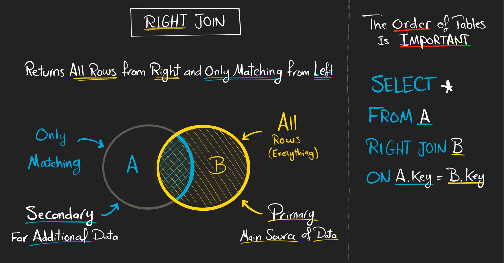
</div>

Use case: _Get all orders, even if they don’t have a matching customer (e.g., bad data)._ 

```sql
SELECT c.first_name, o.order_id, o.sales  
FROM customers c 
RIGHT JOIN orders o 
ON c.id  = o.customer_id;
```

---

### 5️⃣ 🌐 FULL OUTER JOIN
**Full Join** returns **all rows from both tables**.  
If a record has **no match** in the other table, its columns from that table become **NULL**.

```sql
-- Get all customers and all orders, even if there is no match
SELECT c.first_name,o.order_id, o.sales 
FROM customers c 
FULL JOIN orders o  
ON c.id = o.customer_id ;

```

---

## 🅱️ Advanced Joins (Anti Joins & Special)

<div style="text-align:center;">
  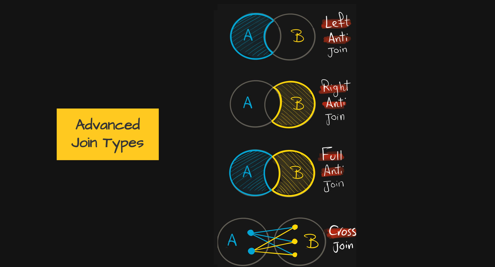
</div>

> 🔎 **Note:** For "anti joins" there is usually **no special keyword** in SQL.  
> We simulate them using a **LEFT/RIGHT/FULL JOIN + a WHERE condition**.

### 1️⃣ 🚫 Left Anti Join
**Left Anti Join** returns rows from the **left table** that **do NOT have a match** in the right table.

<div style="text-align:center;">
  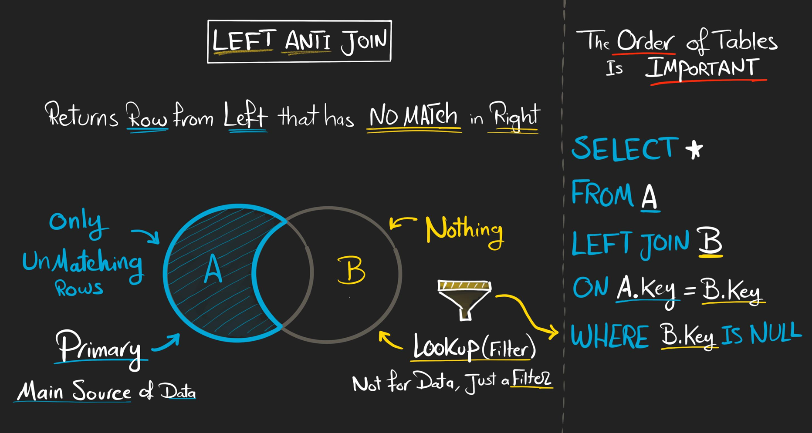
</div>

Use case: _Get all customers who **don’t** have any orders._

```sql
SELECT c.first_name, o.order_id, o.sales  
FROM customers c 
LEFT JOIN orders o 
ON c.id = o.customer_id
WHERE o.customer_id IS NULL; --all the left table data where right table don't have entry
```

---

### 2️⃣ 🚫 Right Anti Join
**Right Anti Join** returns rows from the **right table** that **do NOT have a match** in the left table.

<div style="text-align:center;">
  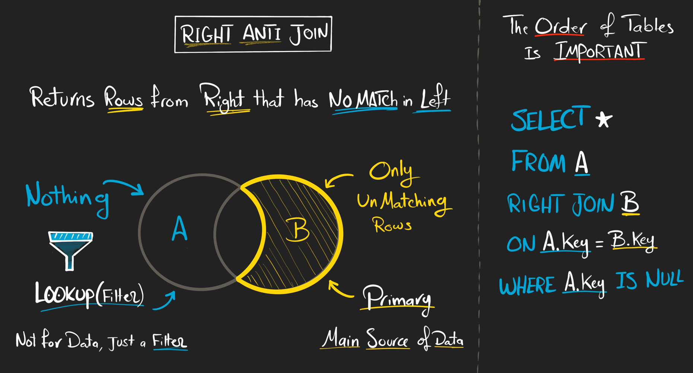
</div>

Use case: _Get all orders that **don’t** have a valid customer in the `customers` table._

```sql
SELECT c.first_name, o.order_id, o.sales  
FROM customers c 
RIGHT JOIN orders o 
ON c.id = o.customer_id
WHERE c.id  IS NULL; --all the right table data where left table don't have entry
```

---

### 3️⃣ 🚫 Full Anti Join
**Full Anti Join** returns rows from **both tables** where there is **no matching row in the other table**.

<div style="text-align:center;">
  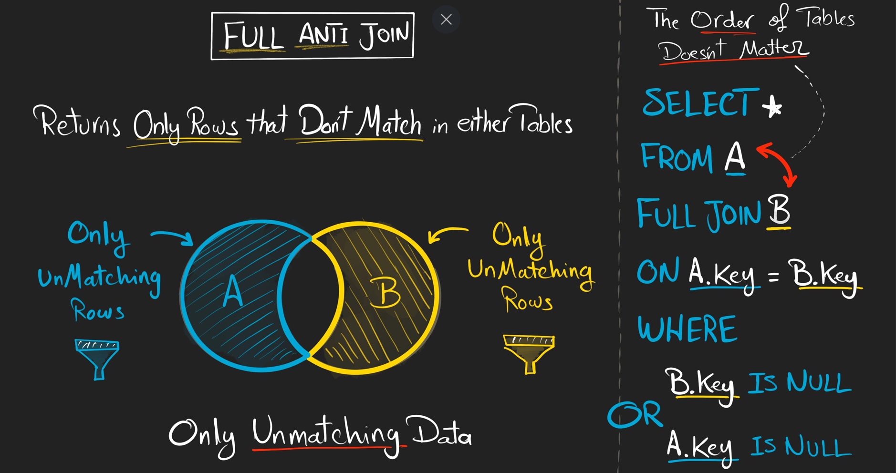
</div>

Use case: _Get all customers and orders that **don’t** have a corresponding valid entry in the other table._

```sql
SELECT c.first_name, o.order_id, o.sales  
FROM customers c
FULL JOIN orders o 
ON c.id = o.customer_id 
WHERE o.customer_id  IS NULL OR c.id IS NULL;
```

---

### 4️⃣ ✖️ CROSS / CARTESIAN JOIN
A **Cross Join** pairs **every row** from one table with **every row** in the other table.  
It does **not** require a join condition.

<div style="text-align:center;">
  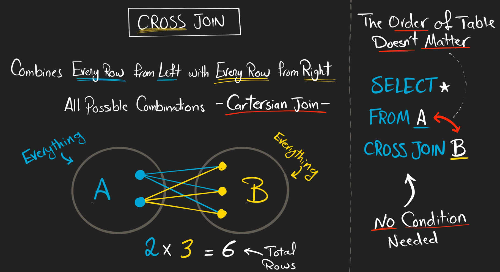
</div>

```sql
SELECT c.first_name, o.order_id, o.sales 
FROM customers c
CROSS JOIN orders o ; --this joins don't need any matching key 
```

---

## 🧠 How to Decide Which Join to Use?

Use this **decision tree** to help you pick the right join:

<div style="text-align:center;">
  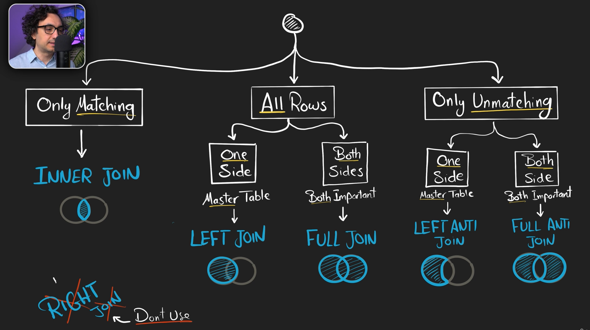
</div>

- Do you want **only matching rows**? → Use **INNER JOIN** 🔍
- Do you want **everything from one table**, and matching from the other? → Use **LEFT** or **RIGHT JOIN** ⬅️➡️
- Do you want **everything from both tables**? → Use **FULL JOIN** 🌐
- Do you want **only non-matching rows**? → Use **Anti Joins** (LEFT/RIGHT/FULL + `WHERE ... IS NULL`) 🚫
- Do you want **every combination of rows**? → Use **CROSS JOIN** ✖️


## multi joins: